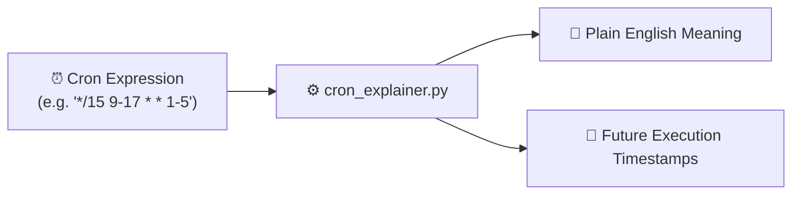

<div align="center">

# 🚀 cron-explainer

### *Human-readable cron schedule translator & execution predictor.*

[](https://github.com/TauqeerMustafa/cron-explainer/actions)
[](LICENSE)
[](https://www.python.org/)
[](cron_explainer.py)
[](CONTRIBUTING.md)

<br/>

<p align="center">
  <a href="#-why-use-cron-explainer">Why cron-explainer?</a> •
  <a href="#-instant-preview">Demo</a> •
  <a href="#-quick-start">Quick Start</a> •
  <a href="#-architecture">Architecture</a> •
  <a href="#-cli-reference">CLI Reference</a> •
  <a href="#-contributing">Contributing</a> •
  <a href="#-license">License</a>
</p>

</div>

---

## 💡 Why Use `cron-explainer`?

- **Plain English Translation**: Instantly converts cryptic cron expressions into human-readable sentences.
- **Schedule Prediction**: Simulates and displays the next N upcoming execution timestamps.
- **Zero Setup**: No heavy cron libraries needed — pure Python standard library.

---

## 🎬 Instant Preview

```bash
$ python cron_explainer.py "*/15 9-17 * * 1-5"
============================================================
⏰ CRON-EXPLAINER REPORT
============================================================
📌 Expression : `*/15 9-17 * * 1-5`
📖 Meaning    : Runs every 15 minutes, from 9 through 17, every day, in every month, on Mon through Fri.
------------------------------------------------------------
📅 Upcoming Schedule:
  [1] 2026-09-12 21:00:00
  [2] 2026-09-12 22:00:00
  [3] 2026-09-12 23:00:00
============================================================
```

---

## ⚡ Quick Start

```bash
# 1. Clone the repository
git clone https://github.com/TauqeerMustafa/cron-explainer.git
cd cron-explainer

# 2. Run CLI tool immediately (No pip install required)
python cron_explainer.py --help
```

---

## 🏛️ Architecture & Workflow



---

## 💻 CLI Reference

| Command | Description |
| :--- | :--- |
| `python cron_explainer.py --help` | Display full help menu and flag options |
| `python cron_explainer.py` | Run default execution mode |

---

## 🤝 Contributing

Contributions, feature suggestions, and pull requests are warmly welcomed!
- Read our [Contributing Guidelines](CONTRIBUTING.md).
- Follow our [Code of Conduct](CODE_OF_CONDUCT.md).

---

## 📄 License

Distributed under the **MIT License**. See [`LICENSE`](LICENSE) for details.

<div align="center">
  <sub>Crafted with ❤️ for the open-source community by <a href="https://github.com/TauqeerMustafa">Tauqeer Mustafa</a>.</sub>
</div>
